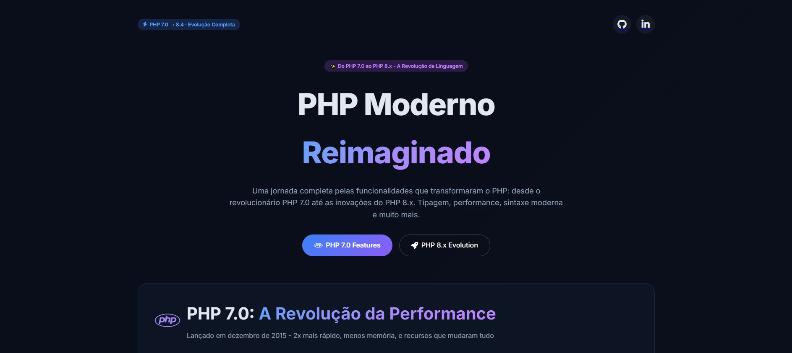
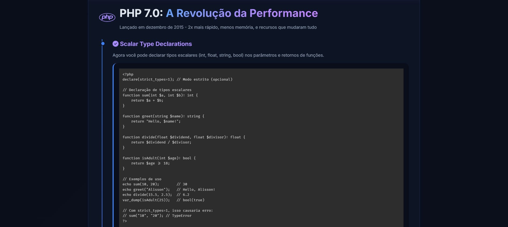
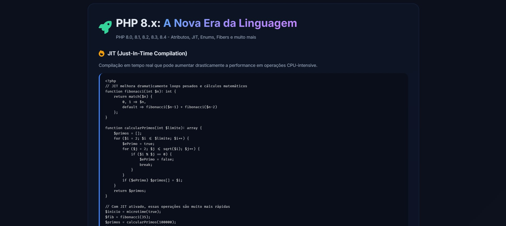

# 🚀 PHP Moderno: Do 7.0 ao 8.x - Guia Completo Interativo

[](https://php.net)
[](https://developer.mozilla.org/en-US/docs/Web/HTML)
[](https://developer.mozilla.org/en-US/docs/Web/CSS)
[](https://developer.mozilla.org/en-US/docs/Web/JavaScript)
[](LICENSE)
[](https://github.com/Alisson-aguiar)
[](https://www.linkedin.com/in/alisson-aguiars2k/)

---

<div align="center">
  
  
  <h1>🚀 PHP Moderno: Do 7.0 ao 8.x</h1>
  
  <p>
    
    
    
    
    
  </p>
  
  <p>
    <a href="https://github.com/Alisson-aguiar">
      
    </a>
    <a href="https://www.linkedin.com/in/alisson-aguiars2k/">
      
    </a>
  </p>
  
  <h3>📖 Uma jornada visual pelas funcionalidades que transformaram o PHP</h3>
  <p><strong>Design moderno • Exemplos práticos • Código funcional • UX fluida • 100% responsivo</strong></p>
  
  
  
  
</div>

---

## 📋 Sobre o Projeto

Este projeto é um **guia interativo e visual** sobre a evolução do PHP desde a versão **7.0** até as mais recentes (**8.4**). Desenvolvido como parte do meu portfólio, ele demonstra não apenas as funcionalidades modernas da linguagem, mas também minhas habilidades em **front-end moderno**, **UX/UI design**, **documentação técnica** e **desenvolvimento web**.

<div align="center">
  
  
</div>

<br />

<div style="background: #f0f6fc; padding: 15px; border-radius: 8px; margin: 20px 0;">

### 🎯 Objetivos do Projeto

| Objetivo | Descrição | Status |
|----------|-----------|--------|
| ✅ Demonstrar features do PHP 7.0 | Apresentar as funcionalidades revolucionárias do PHP 7 | Completo |
| ✅ Apresentar inovações do PHP 8.x | JIT, Attributes, Enums, Fibers, Match, etc | Completo |
| ✅ Fornecer exemplos práticos | Códigos reais e complexos para cada funcionalidade | Completo |
| ✅ Criar UX imersiva | Glassmorphism, animações, responsividade | Completo |
| ✅ Servir como material de estudo | Documentação completa e exemplos funcionais | Completo |
| ✅ Demonstrar habilidades front-end | HTML5 semântico, CSS3 moderno, JS interativo | Completo |

### 🌟 Diferenciais do Projeto

- 🎨 **Design moderno** com efeito Glassmorphism e gradientes
- 📱 **100% responsivo** - funciona em desktop, tablet e mobile
- 💻 **Syntax highlighting** profissional com PrismJS
- 🚀 **Performance otimizada** - carregamento rápido e animações suaves
- ♿ **Acessibilidade** - contraste adequado e HTML semântico
- 📚 **Documentação completa** - cada feature tem explicação e exemplo

---

## ✨ Funcionalidades Demonstradas

### 🔷 PHP 7.0 - A Revolução da Performance (2015)

> O PHP 7.0 foi um marco histórico, trazendo **2x mais performance** e **50% menos consumo de memória**.

| # | Funcionalidade | Descrição | Exemplo de Código |
|---|----------------|-----------|-------------------|
| 1 | **Scalar Type Declarations** | Tipagem para parâmetros escalares (int, float, string, bool) | `function sum(int $a, int $b): int` |
| 2 | **Return Type Declarations** | Garantia de tipo no retorno das funções | `function getName(): string` |
| 3 | **Null Coalescing Operator** | Operador `??` para fallback seguro contra null | `$name = $_GET['user'] ?? 'guest'` |
| 4 | **Spaceship Operator** | Comparação combinada que retorna -1, 0 ou 1 | `$result = $a <=> $b` |
| 5 | **Constant Arrays** | Arrays definidos como constantes com define() | `define('COLORS', ['red', 'green'])` |

### 🔶 PHP 8.x - A Nova Era (2020-2024)

> O PHP 8.x trouxe mudanças revolucionárias, tornando a linguagem mais **segura**, **expressiva** e **poderosa**.

| # | Funcionalidade | Versão | Impacto | Exemplo |
|---|----------------|--------|---------|---------|
| 1 | **JIT Compilation** | 8.0 | Performance CPU-bound até 3x mais rápida | Cálculos matemáticos pesados |
| 2 | **Attributes (Annotations)** | 8.0 | Metadados nativos (substitui docblocks) | `#[Route('/api/users')]` |
| 3 | **Constructor Property Promotion** | 8.0 | Reduz boilerplate em 70% | `public function __construct(private string $name)` |
| 4 | **Match Expression** | 8.0 | Switch sem coerção de tipos, mais seguro | `match($value) { 1 => 'um', default => 'outro' }` |
| 5 | **Nullsafe Operator** | 8.0 | Encadeamento seguro com `?->` | `$user?->address?->city` |
| 6 | **Enums** | 8.1 | Type-safe enumerations com métodos | `enum Status: string { case ACTIVE = 'active'; }` |
| 7 | **Fibers** | 8.1 | Concorrência leve e não bloqueante | `Fiber::suspend()` e `resume()` |
| 8 | **Readonly Properties** | 8.1 | Propriedades imutáveis | `public readonly string $id` |
| 9 | **Readonly Classes** | 8.2 | Classes completamente imutáveis | `readonly class Config {}` |
| 10 | **JSON Validation** | 8.3 | Função nativa `json_validate()` | `json_validate($jsonString)` |
| 11 | **Property Hooks** | 8.4 | Getters/setters nativos (preview) | `public string $name { get => $this->name; }` |

---

## 🎨 Design e UX/UI

### Paleta de Cores

| Cor | Código | Uso |
|-----|--------|-----|
| Azul Principal | `#3b82f6` | Botões, links, bordas de destaque |
| Roxo Gradiente | `#8b5cf6` | Gradientes, badges, destaques |
| Verde Destaque | `#34d399` | Features do PHP 8.x |
| Fundo Escuro | `#0a0e1a` | Background principal |
| Texto Claro | `#e2e8f0` | Conteúdo principal |
| Texto Secundário | `#94a3b8` | Descrições, metadados |

### Efeitos Visuais

- ✨ **Glassmorphism**: Cards com backdrop blur e transparência
- 🌈 **Gradientes dinâmicos**: Cores que evocam a marca PHP
- 🎭 **Hover effects**: Cards elevam e mudam borda ao passar mouse
- 💫 **Animações suaves**: Fade-in nos elementos ao scroll
- 📐 **Sombra moderna**: Box shadows que criam profundidade

### Tipografia

- **Fonte principal**: `Inter` (Google Fonts) - Moderna e altamente legível
- **Fonte de código**: `Fira Code`, `Monaco`, `monospace` - Perfeita para snippets
- **Hierarquia**: Títulos bold, corpo regular, códigos mono-espaçados

---

## 🛠️ Tecnologias Utilizadas

### Front-end Core

| Tecnologia | Versão | Finalidade | Diferencial |
|------------|--------|------------|-------------|
| **HTML5** | Living Standard | Estrutura semântica | Tags semânticas, ARIA labels |
| **CSS3** | Flex/Grid | Layout responsivo | Glassmorphism, variáveis CSS |
| **JavaScript** | ES2020 | Interatividade | Intersection Observer, smooth scroll |
| **PrismJS** | 1.29.0 | Syntax highlighting | 100+ linguagens, temas customizáveis |
| **Google Fonts** | - | Tipografia | Inter (otimizada para web) |
| **Font Awesome** | 6.4.0 | Ícones vetoriais | 2000+ ícones, SVG nativo |

### Recursos CSS Utilizados

```css
/* Glassmorphism Effect */
backdrop-filter: blur(12px);
background: rgba(15, 23, 42, 0.6);

/* Gradientes Dinâmicos */
background: linear-gradient(135deg, #60a5fa, #a78bfa, #c084fc);

/* Animações Smooth */
transition: all 0.3s ease;
animation: fadeInUp 0.6s ease-out;

/* Grid Responsivo */
display: grid;
grid-template-columns: repeat(auto-fit, minmax(320px, 1fr));